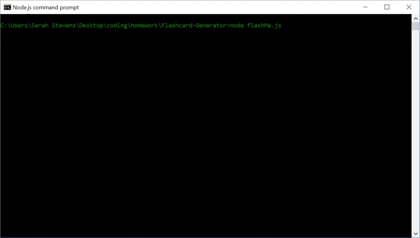

# Flashcard-Generator

How to play:

Open Node and execute node flashMe.js.

At the prompt, select, "Yes-please" to play the game.  Otherwise it will not execute and close.  

There are questions that require a one word answer.  There are others that require the user to fill in the blank.  

SPELLING AND CAPITOLIZATION MATTER!!!!

At the end of the round, a final score is displayed.  

The user can chose to play again, or exit the game.

